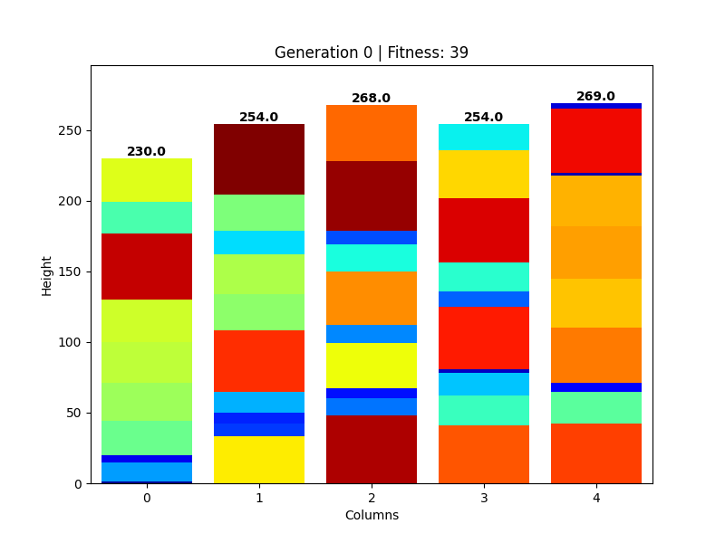

# GeneticBinPacker
This repository contains the code and tests contucted for the **Global and Multi-Objective Optimization** exam of the MSc in Data Science and Artificial Intelligence, held @UniTS.

## About the project
The problem I've chosen to focus on is the famous **Bin Packing** problem. The orgininal statement of the problem stands in having a finite set $I$ of items, with size $s(i), \forall i \in I$, and a positive bin capacity $B$ along with a positive integer $K$. The objective is to find a partition of $I$, such that each partition is entirely contained in one of the $K$ bins.
This problem is computationally *NP-hard*.

However I've decided to study a slight modification of this problem, i.e. given a number $c$ of bins, each containing $b$ items (each of the $c \times b$ items has a different height), find an arrangement of the items such that the maximum height difference between the columns is minimized. The problem can be easilly imagined as having a set of $c$ columns, each of $b$ bricks, with the objective of having the columns' heights as close as possible.

Here an example of the best solutions found by the agorithm at each generation.

---
All the code and the relative tests conducted are present in the [`source/`](./source) folder and in the [python notebook](Bin_Pack.ipynb) provided.
